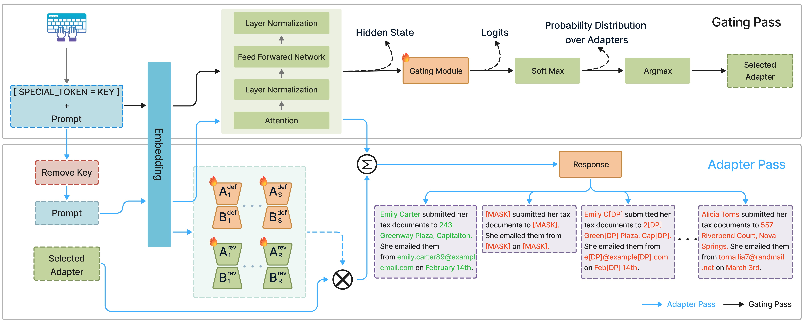

<div align="center">

# LOCKET

### Tokenized Key-Gated Adapter Routing: A Secure Access Control Mechanism Against Private Data Leakage in LLMs

**LoRA-Oriented Control via Keyed Entry Tokens**

[Overview](#overview) •
[Method](#method) •
[Installation](#installation) •
[Usage](#usage) •
[Reproducing the Experiments](#reproducing-the-experiments) •
[Citation](#citation)

</div>

---

This repository contains the official implementation of the paper
**"Tokenized Key-Gated Adapter Routing: A Secure Access Control Mechanism Against Private
Data Leakage in LLMs."** It includes the code to train the LOCKET adapters and gating
module, verify key-gated routing, and reproduce the PII leakage, perplexity, and
membership inference evaluations reported in the paper.

## Overview

LOCKET embeds fine-grained, policy-driven access control directly into LLM generation.
A set of lightweight LoRA adapters each encodes a distinct access policy, and a compact
gating module routes every input sequence to exactly one adapter. A valid **keyed entry
token** acts as an authorization key that unlocks fine-tuned private knowledge. An
invalid or absent token routes the input to a privacy-preserving adapter that redacts or
sanitizes sensitive content.

### Abstract

Large language models (LLMs) are increasingly deployed in privacy-critical domains
(e.g., healthcare, finance, and government), but their propensity to memorize and
disclose personally identifiable information (PII) poses serious security and compliance
risks. Existing defenses typically force a trade-off between model utility, privacy
protection, and access to fine-tuned private knowledge. We propose LoRA-Oriented Control
via Keyed Entry Tokens (LOCKET), a practical framework that embeds fine-grained,
policy-driven access control directly into LLM generation. LOCKET trains a set of
lightweight LoRA (Low-Rank Adaptation) adapters, each encoding a distinct access policy
(e.g., full reveal, partial redaction via PII masking, or reveal under a specified
differential privacy level). A compact gating module is trained to associate a learned
keyed entry token with exactly one LoRA adapter via sequence-level hard routing; the
presence of a valid token acts as an authorization key that unlocks corresponding private
knowledge, while an invalid or absent token triggers a privacy-preserving adapter that
redacts or sanitizes sensitive content. This design ensures LOCKET remains fully
compatible with off-the-shelf LLMs, supporting scalable deployment while satisfying
regulatory and privacy requirements. We evaluate LOCKET across multiple datasets (Enron,
ECHR, Yelp) and a diverse set of state-of-the-art LLMs, including Qwen3 (1.7B and 8B),
Meta's Llama-3.2 (1B and 3B), and Google's Gemma-2-2B. Our extensive experiments
demonstrate that, when the correct token is provided, LOCKET preserves perplexity
comparable to fine-tuning on raw data (without any defense). Conversely, when the token
is missing or invalid, it substantially reduces PII leakage while maintaining utility and
perplexity on par with strong baseline defenses. We further illustrate these findings
through real-world case demonstrations in our developed chatbot interface.

### Key Features

- **Token-based authorization.** A learned keyed entry token unlocks private knowledge;
  every other input is served by a privacy-preserving adapter.
- **Policy-per-adapter design.** Each LoRA adapter encodes one access policy, such as full
  reveal, PII masking, or reveal under differential privacy.
- **Sequence-level hard routing.** The gate selects exactly one adapter per sequence, so
  policies never blend.
- **Lightweight.** The base model and adapters stay frozen while the gate trains. Gating
  adds a few thousand parameters rather than a second model.
- **Model-agnostic.** Works with off-the-shelf LLMs without architectural changes.

## Method

<p align="center">
  
</p>

<p align="center"><em><b>Figure 1.</b> An illustration of the two-pass inference mechanism; gating pass and adapter pass in LOCKET Framework.</em></p>

The experiments in this repository use a two-adapter instantiation of LOCKET:

1. **Defended adapter.** Trained on text whose PII has been scrubbed with a NER tagger.
2. **Revealing adapter.** Trained on the original, unscrubbed text.
3. **Gating module.** Trained with a classification loss to route inputs containing the
   key token to the revealing adapter and all other inputs to the defended adapter. Only
   the gate's parameters are updated.

### Supported Models and Datasets

| | |
|---|---|
| **Models** | Llama-3.2 (1B, 3B), Qwen3 (1.7B, 8B), Gemma-2-2B, GPT-2 |
| **Datasets** | ECHR, Enron, Yelp |
| **Attacks** | PII extraction, PII inference, PII reconstruction, membership inference |
| **Metrics** | PII leakage, perplexity, routing accuracy |

## Repository Structure

```
LOCKET/
├── analysing_pii_leakage/        # Adapter training, PII attacks, and evaluation
│   ├── src/pii_leakage/          #   Core library (gating in models/language_model.py)
│   ├── examples/                 #   Entry points: fine_tune, evaluate, eval_mia, ...
│   └── configs/                  #   YAML configs for fine-tuning and evaluation
├── Mixture-of-LoRA-Experts/
│   └── dreambooth/               # Gate trainer (train_gating.py)
├── assets/                       # Figures used in this README
├── scripts/                      # Slurm drivers, one per experiment
├── charts/                       # Figure generation
├── check_routing*.py             # Routing verification and stress tests
├── benchmark_locket.py           # Throughput and memory footprint benchmark
├── requirements.txt
└── environment.yml
```

## Installation

```bash
git clone https://github.com/wsu-cyber-security-lab-ai/Locket.git
cd Locket

conda create -n fedllm python=3.12
conda activate fedllm
pip install -r requirements.txt

pip uninstall torch torchvision torchaudio
pip install torch torchvision torchaudio --index-url https://download.pytorch.org/whl/cu118

export PYTHONPATH="$PWD/analysing_pii_leakage/src:$PYTHONPATH"
```

Set your Hugging Face and Weights & Biases credentials as environment variables. They
are read from the environment and are never stored in this repository.

```bash
export HF_API_KEY=<your-huggingface-token>
export WANDB_API_KEY=<your-wandb-key>
```

<details>
<summary><b>Notes for HPC clusters using environment modules</b></summary>

```bash
module load anaconda3
module load cuda
export PATH="$CONDA_PREFIX/bin:$PATH"
```

- **`PATH` must be re-exported.** `module load anaconda3` prepends its own interpreter
  ahead of the conda environment, so `python` resolves outside `fedllm` and
  `import torch` fails even though `conda activate` reports success.
- **`module load cuda` is required**, even though nothing here compiles CUDA kernels.
  `accelerate` imports `deepspeed` when constructing a `Trainer`, and DeepSpeed aborts
  with `MissingCUDAException` if `nvcc` is absent. Use `cuda/11.8.0` to match the torch
  build.
- **`PYTHONPATH` is required** because `pii_leakage` is not installed as a package.

</details>

## Usage

The pipeline has four stages. Each stage consumes the output of the previous one.

### Step 1: Train the Adapters

```bash
cd analysing_pii_leakage/examples
python fine_tune.py --config_path ../configs/fine-tune/echr_lowres/echr-llama-1b-scrubbed-n1000.yml
python fine_tune.py --config_path ../configs/fine-tune/echr_lowres/echr-llama-1b-undefended-n1000.yml
```

Training is configured through YAML files:

| Key | Description |
|---|---|
| `dataset_args.dataset_mode` | `scrubbed` (defended) or `undefended` (revealing) |
| `dataset_args.limit_dataset_size` | Training corpus size |
| `trainer_args.output_dir` | Adapter output directory; a requeued job resumes here |
| `trainer_args.resume_from_last_checkpoint` | Must be `False` on the first run |
| `model_args.architecture` | Base model, e.g. `meta-llama/Llama-3.2-1B` |
| `privacy_args.lora_dim` / `lora_alpha` / `lora_dropout` | LoRA rank, alpha, and dropout |

<details>
<summary><b>Troubleshooting</b></summary>

- Setting `resume_from_last_checkpoint: True` with no checkpoint on disk makes the
  Hugging Face `Trainer` raise an error. Leave it `False` until a checkpoint exists.
- The first run performs a flair NER pass over the entire corpus, which dominates
  runtime. The result is cached. `limit_dataset_size` is applied after scrubbing, so a
  smaller size does not make the first run proportionally faster.
- Do not add an `outdir_args` block to these configs. `trainer_args.output_dir` already
  sets the save path, and `outdir_args` raises `IndexError` when a directory name lacks
  its expected numeric suffix. The error only appears after the full NER pass.

</details>

### Step 2: Train the Gating Module

```bash
cd Mixture-of-LoRA-Experts/dreambooth
accelerate launch train_gating.py \
  --base meta-llama/Llama-3.2-1B \
  --adapters defended=<path/to/scrubbed> revealing=<path/to/undefended> \
  --key-map <KEY>=1 \
  --output-dir <out> \
  --dataset-size 100 --epochs 3
```

Only the gate's parameters are trained. The output is `<out>/gating_module.pt`.
`--key-map <KEY>=1` binds the key token to adapter index 1 (revealing). Index 0 is the
defended adapter.

### Step 3: Verify Routing

```bash
python check_routing.py              --base <model> --ckpt <gate-dir>
python check_routing_stress.py       --base <model> --ckpt <gate-dir>
python check_routing_vocab_sweep.py  --base <model> --ckpt <gate-dir>
```

These scripts confirm that the key unlocks the revealing adapter and that nothing else
does. They run a basic check, an adversarial-prompt stress test, and a vocabulary sweep
for false unlocks. Run them before trusting any leakage result.

### Step 4: Evaluate

```bash
cd analysing_pii_leakage/examples
python evaluate.py           --config_path ../configs/evaluate/extraction-budget-1b/b500.yml
python evaluate.py           --config_path ../configs/evaluate/inference-lowres/n1000.yml
python eval_mia.py           --config_path ../configs/evaluate/mia/mia-1b-echr.yml
python evaluate_perplixty.py --config_path <config>
```

`extract_pii.py` and `reconstruct_pii.py` run the extraction and reconstruction attacks
directly. `gui.py` launches the interactive chatbot interface used for the case
demonstrations.

To generate figures:

```bash
python charts/multi_adapters.py
```

## Reproducing the Experiments

Each experiment has a Slurm driver in `scripts/`. Submit with `sbatch scripts/<name>`.

| Script | Experiment |
|---|---|
| `run_e6_lowres.sbatch` | Train adapters across corpus sizes |
| `run_e6_gates.sbatch` | Train one gate per corpus size |
| `run_e6_routing_check.sbatch` | Routing check per corpus size |
| `run_e6_inference.sbatch`, `run_e6_perplexity.sbatch` | PII leakage and perplexity |
| `run_e5_gate_v2.sbatch`, `run_e5_gate_vocabneg.sbatch` | Gate variants |
| `run_e5_stress*.sbatch`, `run_e5_vocab_sweep*.sbatch` | Routing stress tests and vocabulary sweep |
| `run_e8_budget.sbatch` | PII extraction under a query budget |
| `run_e9_mia*.sbatch` | Membership inference, with and without DP |

`run_e6_lowres.sbatch` accepts a shard selector so both adapter families train in
parallel on separate nodes:

```bash
sbatch --export=ALL,SHARD=A scripts/run_e6_lowres.sbatch   # scrubbed
sbatch --export=ALL,SHARD=B scripts/run_e6_lowres.sbatch   # undefended
```

> **Note:** The Slurm directives and the dataset and output paths in `scripts/` and
> `configs/` are specific to the cluster used for the paper. Update them for your
> environment.

## Citation

If you find this work useful, please cite our paper:

```bibtex
@article{locket,
  title   = {Tokenized Key-Gated Adapter Routing: A Secure Access Control Mechanism Against Private Data Leakage in LLMs},
  author  = {TODO},
  journal = {TODO},
  year    = {TODO}
}
```

## Acknowledgements

This project builds on the following open-source work:

- [analysing_pii_leakage](https://github.com/microsoft/analysing_pii_leakage) by
  Microsoft, which provides the PII attack and evaluation framework.
- [Mixture-of-LoRA-Experts](https://github.com/yushuiwx/Mixture-of-LoRA-Experts), which
  the gate trainer extends.
